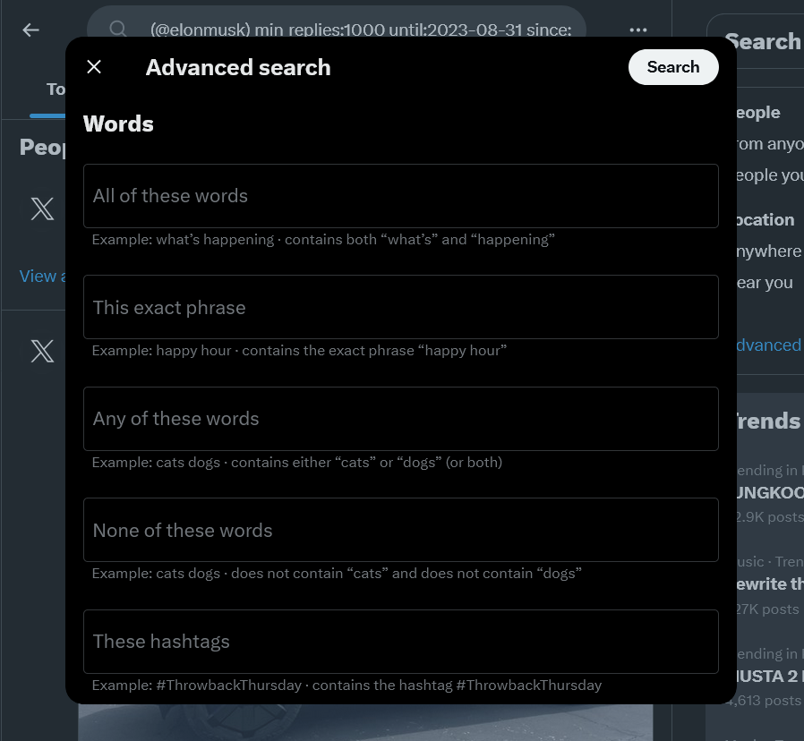

# selenium-twitter-scraper

## Installation

```bash
pip install -r requirements.txt
```

## Authentication

Create a `.env` file in the project root:

```env
TWITTER_AUTH_TOKEN=your_auth_token_here
```

> Obtain your `auth_token` from your browser cookies after logging in to X (Twitter).

## Usage

### Show Help

```bash
python scraper --help
```


### Scraping Examples

```bash
# Scrape 100 tweets
python scraper -t 100

# Scrape tweets from a user profile
python scraper -u elonmusk -t 100

# Scrape tweets from a hashtag (Latest)
python scraper -ht python -t 100 --latest

# Scrape tweets from a hashtag (Top)
python scraper -ht python -t 100 --top

# Scrape tweets from a search query (Latest)
python scraper -q "Artificial Intelligence" -t 100 --latest

# Scrape tweets from a search query (Top)
python scraper -q "Artificial Intelligence" -t 100 --top

# Scrape without a tweet limit
python scraper -ntl
```

## Advanced Search

For more complex searches, use X/Twitter Advanced Search to build your query, then copy the generated query string into the scraper.

* **Twitter Advanced Search:** https://twitter.com/search-advanced

[](./img/advanced-search-01.png)

Example:

```bash
python scraper --query='("PPN 12" OR "PPN 12 Persen") until:2024-10-31 since:2024-10-01' -ntl
```

### Modifications

* Replaced username/password login with Twitter/X Auth Token authentication.
* Added `reply_to` tweet extraction for conversation and network analysis.

Original project: [selenium-twitter-scraper](https://github.com/godkingjay/selenium-twitter-scraper)

